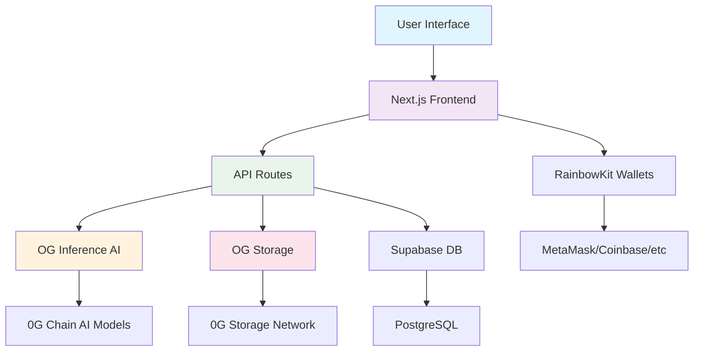

# MemeForge 🎭

<div align="center">


**Create, remix, and store AI-powered memes permanently on-chain**

[Features](#features) • [Demo](#demo) • [Installation](#installation) • [Usage](#usage) • [API](#api) • [Deployment](#deployment)

</div>

## 🚀 Overview

MemeForge is a cutting-edge platform that combines AI creativity with blockchain permanence. Generate hilarious memes using OG Inference AI models and store them permanently on OG Storage with verifiable on-chain hashes.

### ✨ Key Features

- **🤖 AI-Powered Generation**: Create memes using state-of-the-art AI models (Llama 3.3 70B, DeepSeek R1 70B)
- **🔗 Permanent Storage**: Store memes permanently on 0G Chain with cryptographic verification
- **🎨 Multiple Creation Modes**: Text prompts, image uploads, or AI-generated captions
- **💫 Glassmorphism UI**: Beautiful modern design with frosted glass effects
- **👛 Wallet Integration**: Connect with RainbowKit (MetaMask, Coinbase, WalletConnect, etc.)
- **🔄 Remix & Share**: Remix existing memes and share with verifiable storage links
- **📱 Responsive Design**: Works seamlessly across all devices

## 🏗️ Architecture



## 🛠️ Tech Stack

### Frontend
- **Framework**: Next.js 14 with App Router
- **Styling**: Tailwind CSS + Glassmorphism Design
- **UI Components**: shadcn/ui + Radix UI
- **Wallet Integration**: RainbowKit + Wagmi + Viem
- **Animations**: Framer Motion

### Backend & Storage
- **AI Inference**: 0G Compute, OG Inference
- **Storage**: 0G Chain OG Storage
- **Database**: Supabase (PostgreSQL)
- **Blockchain**: 0G Testnet

### AI Models
- **Llama 3.3 70B Instruct** - Primary meme caption generation
- **DeepSeek R1 70B** - Alternative AI model

## 📦 Installation

### Prerequisites

- Node.js 18+ 
- npm or yarn
- Ethereum wallet (MetaMask recommended)
- 0G Testnet configured in your wallet

### 1. Clone Repository

```bash
git clone https://github.com/embolaweb3/MemeForge.git
cd memeforge
```

### 2. Install Dependencies

```bash
npm install
# or
yarn install
```

### 3. Environment Configuration

Create `.env.local` file:

```env
# 0G Chain Configuration
PRIVATE_KEY=your_ethereum_private_key_here
OG_RPC_URL=https://evmrpc-testnet.0g.ai/
OG_INDEXER_RPC=https://indexer-storage-testnet-standard.0g.ai

# OG Inference Official Providers
OG_PROVIDER_LLAMA=0xf07240Efa67755B5311bc75784a061eDB47165Dd
OG_PROVIDER_DEEPSEEK=0x3feE5a4dd5FDb8a32dDA97Bed899830605dBD9D3

# WalletConnect
NEXT_PUBLIC_WALLETCONNECT_PROJECT_ID=your_walletconnect_project_id

# Supabase Database
SUPABASE_URL=your_supabase_url
SUPABASE_ANON_KEY=your_supabase_anon_key

# Next.js
NEXT_PUBLIC_APP_URL=http://localhost:3000
```

### 4. Run Development Server

```bash
npm run dev
# or
yarn dev
```

Open [http://localhost:3000](http://localhost:3000) in your browser.

## 🎯 Usage

### Creating Your First Meme

1. **Connect Wallet**: Click "Connect Wallet" and choose your preferred wallet
2. **Choose Creation Method**:
   - **Text Prompt**: Describe your meme idea (e.g., "funny cat wearing sunglasses")
   - **Image Upload**: Upload your own image and let AI generate a caption
   - **AI Options**: Get multiple caption variations and choose your favorite
3. **Generate**: Click "Generate Meme" - AI creates your meme and stores it permanently
4. **Share & Mint**: Download, share, or mint your meme as an NFT

### Features in Action

#### 🧠 AI Meme Generation
```javascript
// Example API call to generate meme
const response = await fetch('/api/generate', {
  method: 'POST',
  body: JSON.stringify({
    prompt: "funny cat wearing sunglasses",
    creator: "0xYourWalletAddress"
  })
});
```

#### 💾 Permanent Storage
Every meme gets:
- **Root Hash**: Cryptographic proof of storage
- **Transaction Hash**: On-chain verification
- **Metadata**: AI prompt, creator, timestamp stored separately

#### 🔄 Remix Mode
- Remix any meme from the trending feed
- Change captions or add new twists
- Create derivative works while maintaining attribution

## 📡 API Reference

### Generate Meme
**POST** `/api/generate`

```json
{
  "prompt": "funny cat meme",
  "image": "data:image/png;base64,...", // optional
  "creator": "0xWalletAddress"
}
```

**Response:**
```json
{
  "success": true,
  "memeUrl": "data:image/png;base64,...",
  "storageHash": "0x1a2b3c4d5e6f7g8h9i0j...",
  "transactionHash": "0x9i8h7g6f5e4d3c2b1a...",
  "caption": "When you're a cat but also cool 😎",
  "verification": {
    "image": "https://og-scan.com/tx/0x...",
    "storage": "https://og-storage.com/file/0x..."
  }
}
```

### Get AI Options
**POST** `/api/generate/options`

```json
{
  "prompt": "funny programming meme",
  "count": 3
}
```

### Download Meme
**GET** `/api/storage/download?hash=0xRootHash`

### Verify Storage
**POST** `/api/storage/verify`

```json
{
  "rootHash": "0x1a2b3c4d5e6f7g8h9i0j"
}
```
